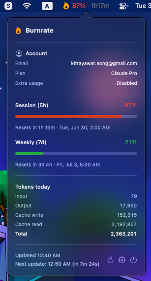

# 🔥 Burnrate
**Claude Code Usage Monitor for macOS** · Built with [Claude](https://claude.ai)

A menu bar app that shows your [Claude Code](https://claude.ai/code) usage at a glance — session %, reset countdown, and token breakdown.



---

## Features

- **Menu bar** — flame icon + session % (traffic-light colored) + countdown to reset
- **Popover** — session & weekly progress bars with reset times (day of week), today's token breakdown, account info
- **Notifications** — alert when usage crosses a configurable threshold; works even when the app is in the foreground
- **Persists last fetch** — shows cached values on 429 / offline with a stale warning
- **Refreshes on wake** — polls immediately when the Mac wakes from sleep
- **Webhook** — POST JSON payload to any URL after each successful fetch (Make, n8n, Zapier, custom server)
- **Smart notifications** — threshold alert fires once per usage period; separate alert when session or weekly resets
- **Auto-refresh on reset** — schedules a timer to poll exactly when a period expires, not just on the regular interval
- **Settings** — 7-tab window: toggle what shows in the menu bar / popover, adjust poll interval, configure notifications and webhook
- **Debug tab** — simulate usage % for testing UI and notifications without burning real quota

## Requirements

- macOS 13 Ventura or later
- [Claude Code](https://claude.ai/code) installed and signed in

## Installation

### Homebrew (recommended)

```bash
brew tap kittayawat-aong/burnrate
brew trust kittayawat-aong/burnrate   # required for third-party taps
brew install --cask burnrate
```

**First launch — Gatekeeper quarantine**

macOS blocks apps downloaded from the internet. After installing, either:

- Open **System Settings → Privacy & Security** and click **Open Anyway**, or
- Run in Terminal:

```bash
xattr -dr com.apple.quarantine /Applications/Burnrate.app
```

**Token expired after install?**

If Burnrate shows "Token expired", your Claude Code session may have lapsed. Re-authenticate with:

```bash
claude auth login
```

### Build from source

```bash
git clone https://github.com/kittayawat-aong/burnrate.git
cd burnrate
xcodebuild -scheme Burnrate -configuration Release -derivedDataPath build/release build
cp -R build/release/Build/Products/Release/Burnrate.app /Applications/
open /Applications/Burnrate.app
```

On first launch macOS may prompt to allow access to the `Claude Code-credentials` Keychain item — choose **Always Allow**.

> **Note:** App Sandbox is disabled so the app can read Claude Code's Keychain entry and `~/.claude/` logs. No data leaves your machine except the usage API call to `api.anthropic.com`.

## How it works

1. Reads `Claude Code-credentials` from Keychain → extracts OAuth access token
2. Calls `GET https://api.anthropic.com/api/oauth/usage` to fetch session & weekly utilization
3. Parses `~/.claude/projects/**/*.jsonl` for today's token counts
4. Reads `~/.claude.json` for account info (email, plan, etc.)

## Settings

| Tab | Options |
|-----|---------|
| General | Launch at login |
| Menu Bar | Show session %, countdown, weekly % |
| Popover | Show account info, weekly usage, token breakdown |
| Notifications | Enable alerts, set threshold % |
| Polling | Poll interval (1–30 min) |
| Webhook | URL, enable/disable, payload preview |
| Debug | Simulate session / weekly % for UI testing |

## Project layout

```
Burnrate/
├── BurnrateApp.swift
├── AppDelegate.swift          # NSStatusItem, NSPopover, polling, wake observer
├── Models/
│   ├── UsageResponse.swift    # defensive parser for /api/oauth/usage
│   ├── AccountInfo.swift      # ~/.claude.json account fields
│   └── TokenSummary.swift
├── Services/
│   ├── KeychainService.swift  # reads Claude Code-credentials
│   ├── UsageAPIService.swift  # OAuth usage endpoint
│   ├── AccountService.swift   # parses ~/.claude.json
│   ├── JournalService.swift   # parses ~/.claude/projects/**/*.jsonl
│   ├── NotificationService.swift
│   ├── WebhookService.swift    # POST usage payload to configurable URL
│   └── UsageCache.swift       # UserDefaults persistence
├── ViewModels/
│   ├── UsageViewModel.swift
│   └── AppSettings.swift
├── Views/
│   ├── UsagePopover.swift
│   └── SettingsView.swift
└── Utilities/
    ├── TimeFormatter.swift
    └── UsageColor.swift
```

## Webhook payload

When enabled, Burnrate sends a `POST` with `Content-Type: application/json` after every successful fetch. Timestamp is UTC+0.

```json
{
  "timestamp": "2026-06-30T00:40:00Z",
  "session": { "utilization": 87.0, "resets_at": "2026-06-30T02:00:00Z" },
  "weekly":  { "utilization": 21.0, "resets_at": "2026-07-03T05:00:00Z" },
  "tokens":  {
    "input": 79, "output": 17950,
    "cache_write": 152315, "cache_read": 2192857,
    "total": 2363201
  }
}
```

Compatible with Make, n8n, Zapier, or any HTTP endpoint.

## Notes

- The `/api/oauth/usage` endpoint is undocumented and may change without notice; the response parser is intentionally defensive about field names.
- App Sandbox must be disabled to access another app's Keychain item and `~/.claude/` — this means the app is not App Store distributable as-is.

## License

MIT
